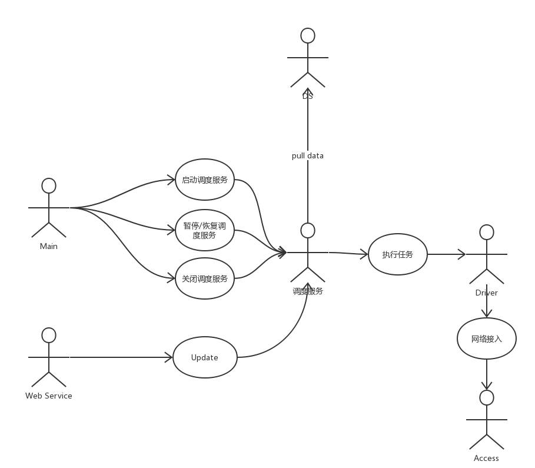
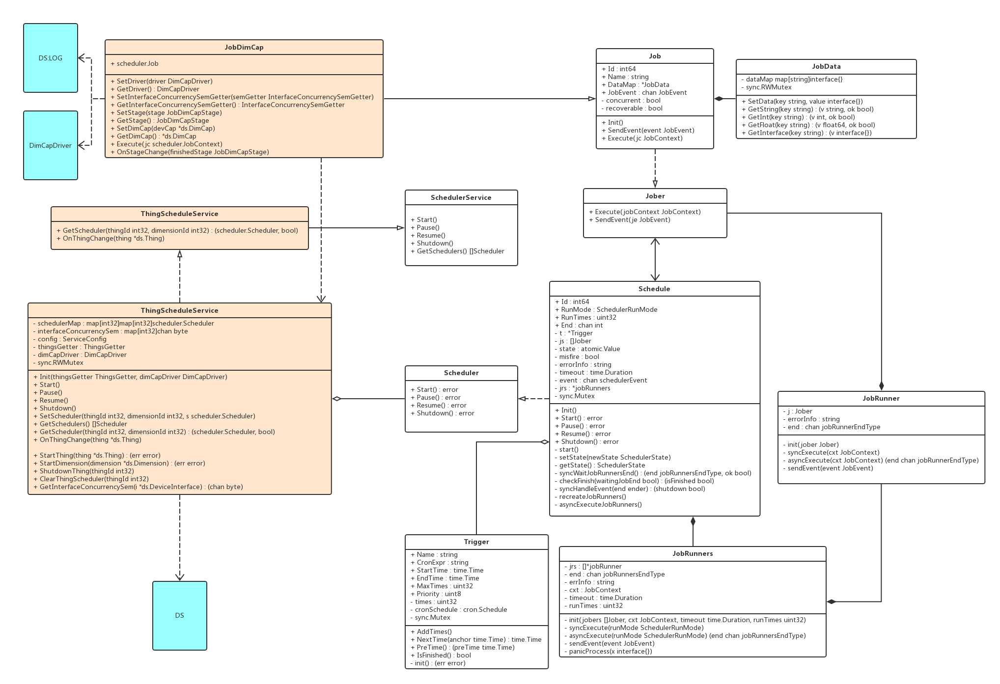
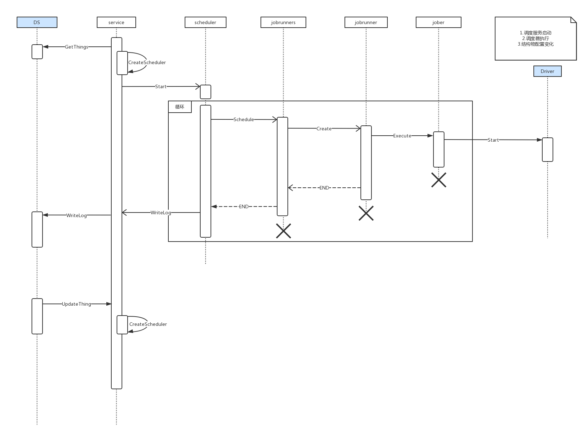

#TSC(Task schedule center) 计划书

---

##目标分解
1. 理解公司后端业务模型
2. 掌握任务调度部分的业务需求
3. 理解目前使用较广泛的任务调度相关的模型和实现
4. 设计任务调度模块
5. 编写计划书
6. 编写代码
7. 单元测试
8. 联调测试
9. 压力测试

---

##怎么做
###理解公司后端业务模型
- 开会讨论
- 相关图表阅读

###掌握任务调度部分的业务需求
- 开会讨论
- 外部接口定义讨论
- 相关设计文件阅读

###理解目前使用较广泛的任务调度相关的模型和实现
- Quartz
- iamduo/workq
- robfig/cron

###设计任务调度模块
- 脑中构思
- 草图绘制

###编写计划书
- 目标实现功能
- 数据结构定义
- 接口设计
- 图示：类图、状态图、时序图、用例图
- 开发和运行环境
- 目标性能指标
- 关键技术说明
- 时间计划

### 编写代码
### 单元测试
### 联调测试
### 压力测试

---

##能力匹配
- 技术文档阅读能力
- 图表阅读能力
- 系统设计能力
- 绘图绘表能力
- 文字说明能力
- 代码编写能力
- 代码重构能力
- 测试能力

---

##相关知识储备
- cron表达式
- 恢复机制
- 调度策略
- 异步调用/处理的编码能力
- 并发编程能力

---

##计划书
###目标实现功能
1. 将thing转换为“可调度任务”
2. 实现各种策略调度任务
3. 任务可控性：start、pause、resume、shutdown
4. 任务在成功、错误时的处理
5. 任务在硬关闭（进程崩溃、机器关闭等）后的恢复能力
6. 监听任务状态变化：立即启动、重启、暂停、恢复、结束
7. 监听任务运行stage变化：连接、数据请求阶段、数据应答阶段、规则阶段
8. 日志写入：dimensionLog、dimCapLog

###数据结构定义
<pre>
	package iota/scheduler 			//tsc
	package iota/scheduler/thing 	//thing tsc
</pre>
####数据结构定义
- ScheduleService
<pre>
type ScheduleService interface {
	Start()
	Pause()
	Resume()
	Shutdown()
	GetSchedulers() []Scheduler
}
</pre>

- ThingScheduleService
<pre>
type ThingScheduleService interface {
	scheduler.ScheduleService
	GetScheduler(thingId int32, dimensionId int32) (scheduler.Scheduler, bool)
	OnThingChange(thing *ds.Thing)
}
</pre>

- Scheduler
<pre>
type Scheduler interface {
		Start() error
	Pause() error
	Resume() error
	Shutdown() error
}
</pre>

- Schedule
<pre>
type Schedule struct {
	Id        int64 //uuid
	t         *Trigger
	js        []Jober
	state     atomic.Value
	RunMode   SchedulerRunMode
	RunTimes  uint32 //run how many times per trigger
	misfire   bool   //if missed , recover will work
	errorInfo string
	End       chan int      //if all job end,the channel will send a end sem
	timeout   time.Duration //if jobs run too much time,we should break them
	event     chan schedulerEvent
	jrs       *jobRunners
	sync.Mutex
}
</pre>

- Trigger
<pre>
type Trigger struct {
	Name         string
	CronExpr     string    //cron expression
	StartTime    time.Time //begin trigger timming
	EndTime      time.Time //if EndTime earlier than StartTime ,means it will not end,unless scheduler shutdown
	MaxTimes     uint32    //trigger count,<=0 means infinity
	Priority     uint8     //max 255,bigger number means higher priority
	times        uint32    //how many times job triggered
	cronSchedule cron.Schedule
	sync.Mutex
}
</pre>

- Jober
<pre>
type Jober interface {
	Execute(jobContext JobContext)
	SendEvent(je JobEvent)
}
</pre>

- Job
<pre>
type Job struct {
	Id          int64
	Name        string //a name for description
	DataMap     *JobData
	concurrent  bool //if false,job can't run concurrently
	recoverable bool //if false,misfire won't recover
	JobEvent    chan JobEvent
}
</pre>

- JobDimCap
<pre>
type JobDimCap struct {
	scheduler.Job
}
</pre>

- JobData
<pre>
type JobData struct {
	dataMap map[string]interface{}
	sync.RWMutex
}
</pre>

####对外接口调用
- 获得ThingSchedulerService
<pre>
	(iota.scheduler.thing).NewThingScheduleService(thingGetter ThingsGetter, dcDriver DimCapDriver) (service ThingScheduleService)
</pre>

####需要的接口
- DS：获取所有Thing数据
<pre>
	(iota.scheduler.ds).GetThings()([]*Thing,error)
</pre>

- DS：注册监听Thing变化的回调函数
<pre>
	(iota.scheduler.ds).OnStageChange func(finishedStage JobDimCapStage)
</pre>

- DS: 写入DimensionTaskLog数据
<pre>
	(iota.scheduler.ds).InsertDimensionTaskLog(log DimensionTaskLog)
</pre>

- DS：写入DimCapTaskLog数据
<pre>
	(iota.scheduler.ds).InsertDimCapTaskLog(log DimCapTaskLog)
</pre>

###图示
- 用例图

- 类图

- 时序图

###关键技术
####调度器运行时状态控制
- 可能状态：未开始，已开始，超时，错误
- 未开始：允许开始
- 已开始：允许接受各种外部状态：暂停、恢复、停止、超时
- 完成：生成tasklog，不再接受重启的要求
- 超时：通知所有未完成的job，超时消息，生成tasklog
- 错误：错误数和错误消息都应记录在tasklog中

####增强robfig/cron
- 基于robfig/cron (https://github.com/robfig/cron) , a cron library for go
- 支持@now == @every 1s,立即执行
- 支持@every {n}M,月份的interval支持

###开发运行环境
- 开发环境：liteIDE+windows+svn
- 运行环境：跨平台(windows,linux,mac)

###目标性能指标
根据具体执行业务确定

###工时计划
| 流程 | 人日 | 人时 |
|:---------:|:---------:|:---------:|
|数据结构建立|0.5|4|
|对象方法实现|1|8|
|调度策略实现|1.5|12|
|外部接口编写|1|8|
|单元测试编写|0.5|4|
|测试和debug|1|8|
|review和重构|1|8|
|联调测试|x|x|
|文档编写|x|x|
|发布|x|x|
|总计|6.5(??)|52(??)|
