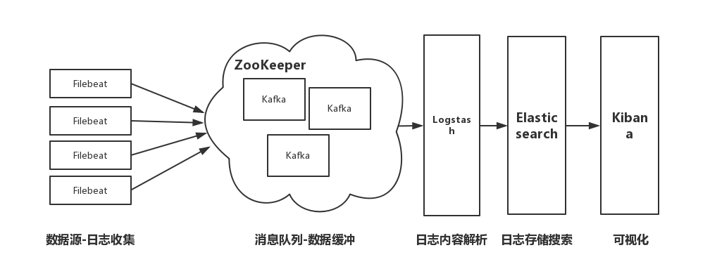

# 部署方案

# 整体部署图示

<pre>
Kafka的作用在于，LogStash需要扩充为集群时，提供负载均衡
</pre>

# 组件清单

| 组件 | 进程数 |
|:---------:|:---------:|
|FileBeat|n|
|LogStash|1-n|
|ElasticSearch|2-n|
|Kibana|1|
|Kafka|0-n|

# 组件说明

## FileBeat
<pre>
部署在日志源文件宿主机上，负责监听日志文件变化，以 tail -f 行输出的方式向LogStash输出日志数据
是整个系统的 data collector
</pre>

## LogStash
<pre>
以单机或集群的方式提供集中式的日志 transform,parse 等功能，并向ElasticSearch输出规整后的日志数据(json)
</pre>

## ElasticSearch
<pre>
以集群的方式提供集中式的日志 search,analyze,store 等功能，并向Kibana提供日志 search,analyze 的接口(http restful api)
</pre>

## Kibana
<pre>
提供web的方式查询、分析 ElasticSearch 中的数据，可以安装 X-Pack 以支持 ElasticSearch & Kibana 集群的监控
</pre>

# 配置文件

## FileBeat

path:
>./filebeat.yml

<pre>
filebeat.prospectors:
- input_type: log
  paths:
    - C:\develop\project\iota\ssmc\trunk\code\gowork\src\iota\test\demo\czy\console.log
output.logstash:
  hosts: ["localhost:5044"]
</pre>

## LogStash

path:
>./conf/logstash.conf

<pre>
input{
	beats {
    	port => 5044
    	codec => multiline{
			pattern => "^[0-9]+/"
			what => "previous"
			negate => true
		}
  	}
}

filter{
	grok{
		match => {
			"message" => "%{DATE_EU:date} %{TIME:time} %{GREEDYDATA:log}"
		}
		remove_field => ["message"]
	}
	mutate {
  		add_field => {
    		"e-date" => "%{date} %{time}"
  		}
  		remove_field => ["date", "time"]
	}
	date{
		match => [ "e-date" , "yy/MM/dd HH:mm:ss"]
		remove_field => ["e-date"]
	}
}

output{
	elasticsearch{
		hosts => ["localhost:9200"]
		index => "logstash-beatlog-%{+YYYY.MM.dd}"
		flush_size => 1000
	}
}
</pre>

## ElasticSearch

path:
>./config/elasticsearch.yml

<pre>
cluster.name: iota-log
node.name: node-main
node.max_local_storage_nodes : 2

xpack.security.enabled: false
</pre>

## Kibana

path:
>./config/kibana.yml

<pre>
# nothing
</pre>

# 部署
## FileBeat

### 安装

> https://www.elastic.co/guide/en/beats/filebeat/current/filebeat-installation.html

### 启动

> https://www.elastic.co/guide/en/beats/filebeat/current/filebeat-starting.html

## LogStash

### 安装

> https://www.elastic.co/guide/en/logstash/current/installing-logstash.html

### 启动

<pre>
${LogStash-Home}/bin/logstash -f ${Config-Path}
</pre>

## ElasticSearch

### 安装

> https://www.elastic.co/guide/en/elasticsearch/reference/current/_installation.html

### 启动

<pre>
${Elastic-Home}/bin/elasticsearch
</pre>

## Kibana

### 安装

> https://www.elastic.co/guide/en/kibana/current/install.html

### 启动

<pre>
${Kibana-Home}/bin/kibana
</pre>

# 参考

> https://www.elastic.co/guide/index.html