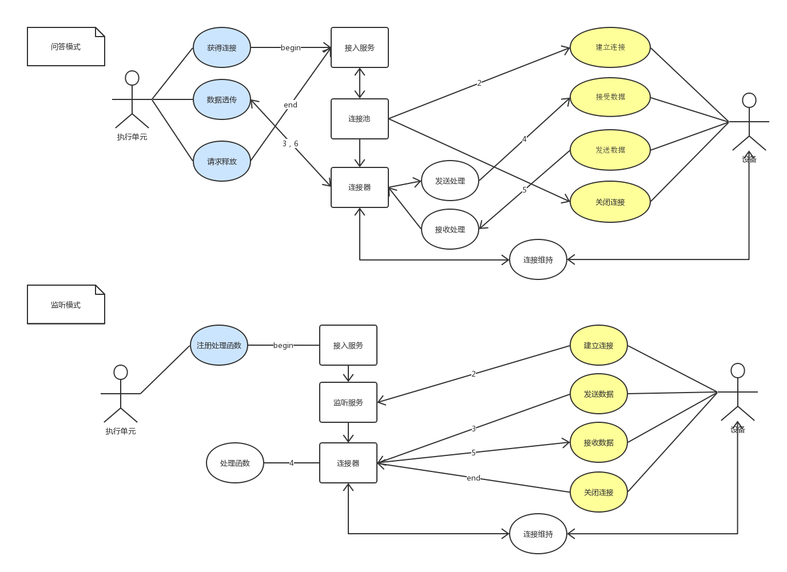

# DAL (Device Access Layer) 计划书

---

## 目标分解
1. 理解公司后端业务模型
2. 了解常见IoT设备协议、接口
3. 了解第三方开源IoT接入解决方案
4. 编写计划书，绘出设计图
5. 编写框架代码
6. 编写实现代码
7. 如需迭代返回4
8. 单元测试
9. 压力测试
10. 联调测试
11. 完善说明文档，交付代码 

---

## 怎么做
### 理解公司后端业务模型
- 开会讨论
- 相关图表阅读

###了解常见IoT设备协议、接口
- 阅读目前DTU代码
- 寻找并阅读常用协议、接口资料

### 了解第三方开源IoT接入解决方案
- 物联网云平台功能研究
- 寻找并理解开源代码实现方式

### 编写计划书，绘出设计图
- 设计计划书:markdown+html
- 用例图
- 类关系图
- 时序图

### 编写框架代码
- 各个组件interface定义
- 各个组件基本数据类型
- 通用服务实现代码
- 优化外部易用性

### 编写实现代码
- 对各种协议、接口编写网络通信驱动
- 对各种协议、接口内部实现连接池管理（连接器生命周期管理）

### 单元测试
- 对每种协议、接口至少实现一种模式（主动模式/被动模式）的通信用例
- 对边界条件进行测试（粘包、空数据、大量数据、高并发测试）

### 压力测试
- 对每种协议、接口进行benchmark测试
- 优化benchmark数据
- 真实环境压力模拟测试

### 联调测试
- 与各种外部模块进行流水线测试
- 确保能正确提供外部需要的服务

---

## 相关知识储备
- 各种协议、接口规范掌握
- 常用连接池模型掌握
- Linux/Windows系统TCP/IP能力模型掌握

---

## 实现
### 功能分解
1. 根据规范编写各种连接驱动
2. 连接异常处理（超时、重连、非法数据）
3. 连接池管理策略（伸缩性、旧连接重用命中策略）
4. 监听器实现
5. 连接器（维持连接、控制报文处理）实现

### 模型定义
#### 路径
<pre>
	package iota/access 			//dal
	package iota/access/conn 		//conn
	package iota/access/conn/driver //conn driver
	package iota/access/pool		//conn pool
	package iota/access/listener	//listener
</pre>
#### 数据结构定义

#### 对外接口调用

#### 需要的接口

### 图示
- 用例图

- 子模块层次图

### 关键技术

### 开发运行环境
- 开发环境：liteIDE+windows+svn
- 运行环境：跨平台(windows,linux,mac)

###目标性能指标
根据具体执行业务确定

### 工时计划
| 流程 | 人日 | 人时 |
|:---------:|:---------:|:---------:|
|暂无|暂无|暂无|
